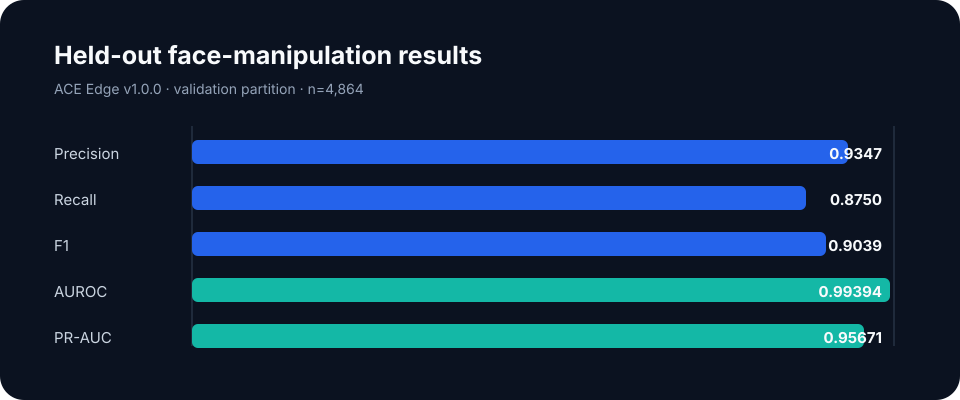
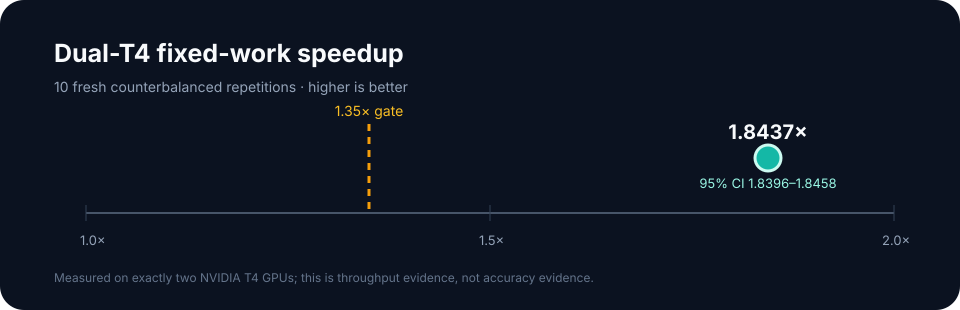

# ACE Edge

### Compact, evidence-first deepfake and face-manipulation detection

[](https://github.com/Anyashprasad/ACE-deepfake-detector/releases/tag/ace-edge-v1.0.0)
[](https://github.com/Anyashprasad/ACE-deepfake-detector/actions/workflows/ci.yml)


ACE Edge is a compact three-class research model for **likely real**, **AI-generated**, and **face-manipulated** media. Its validated release claim is deliberately narrow: strong held-out face-manipulation detection, with the AI-generated class retained only for exploratory analysis.

It is not a universal AI-image detector, an authenticity oracle, or a forensic conclusion.

<p align="center">
  
</p>

## Validated release

The public [`ace-edge-v1.0.0`](https://github.com/Anyashprasad/ACE-deepfake-detector/releases/tag/ace-edge-v1.0.0) weights were selected under frozen research gates. On the held-out face-manipulation validation partition of 4,864 samples, including 720 face-manipulated samples, the release achieved:

| Metric | Result |
| --- | ---: |
| Precision | **0.9347** |
| Recall | **0.8750** |
| F1 | **0.9039** |
| AUROC | **0.99394** |
| PR-AUC | **0.95671** |

The dual-T4 fixed-work benchmark also cleared its pre-registered 1.35× gate:

<p align="center">
  
</p>

The measured median speedup was **1.8437×**, with a **95% confidence interval of 1.8396–1.8458**, across 10 fresh counterbalanced repetitions.

## Why ACE Edge exists

The original ACE 2.4 prototype is preserved as a historical baseline. A clean SDFVD evaluation exposed a serious generalisation failure—50% balanced accuracy and 0% fake recall—showing that earlier near-99% development results did not justify a broad robustness claim.

ACE Edge restarts the research pipeline with:

- grouped source-family splits instead of frame-level leakage;
- exact and perceptual content-hash checks across splits;
- held-out generator families;
- canonical class and prediction contracts;
- frozen release gates and per-sample evidence;
- fixed-work one-versus-two-GPU benchmarking.

## Run inference

Download `ace-edge-v1.weights.h5` from the [v1.0.0 release](https://github.com/Anyashprasad/ACE-deepfake-detector/releases/tag/ace-edge-v1.0.0), then verify:

```text
SHA-256  cc88d6e5a5a744a7e51645787a34f5c3c077c1d7e7ea6f53a532bdf2f02052fa
```

From `ace-edge/` in a clean Python environment:

```bash
python -m pip install -r requirements-inference.txt
python -m ace_edge.inference \
  --weights /path/to/ace-edge-v1.weights.h5 \
  --image /path/to/image.jpg
```

The loader reconstructs the frozen v1 architecture without downloading ImageNet weights and verifies the release checksum by default. See the [ACE Edge guide](ace-edge/README.md) for preprocessing, optional local-crop input, and training instructions.

## Research boundaries

- Scores are evidence for analysis, not proof that media is authentic.
- Do not use ACE Edge for identity verification, enforcement, or criminal attribution.
- The `ai_generated` class generalised unevenly to unseen generators, especially VQDM; do not market it as broad synthetic-image detection.
- `inconclusive` is reserved for a future calibrated abstention policy and is not a learned fourth class.
- Raw datasets, private FF++ derivatives, manifests, checkpoints, and predictions are not redistributed.

## Documentation

- [Model card](ace-edge/MODEL_CARD.md)
- [Dataset and provenance notices](ace-edge/DATASET_NOTICES.md)
- [Release review contract](ace-edge/review/README.md)
- [Frozen review checklist](ace-edge/review/REVIEW_CHECKLIST.md)

## Historical artifacts

ACE 2.4 code and weights remain in the repository for reproducibility and comparison only. They must not be described as generally robust or used as evidence that media is authentic.
